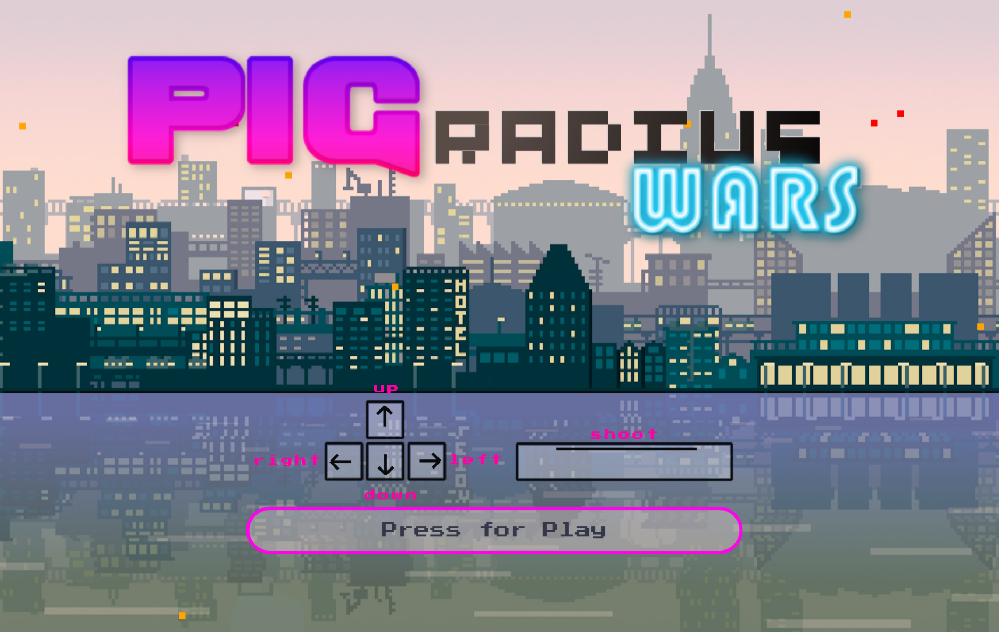
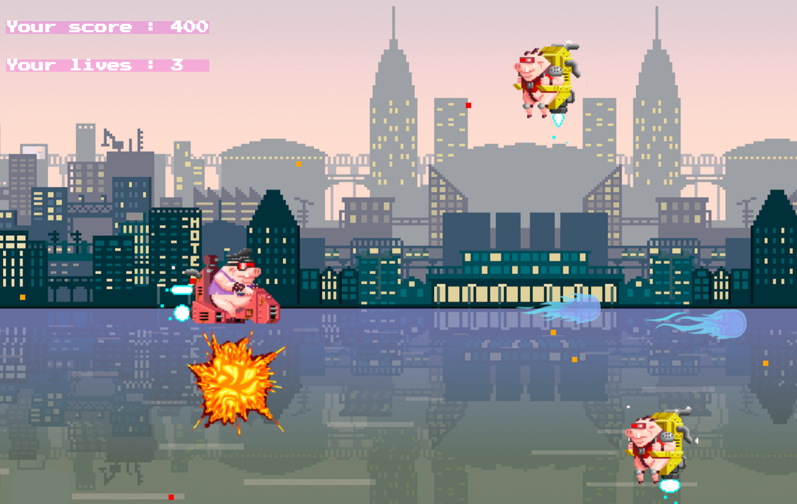
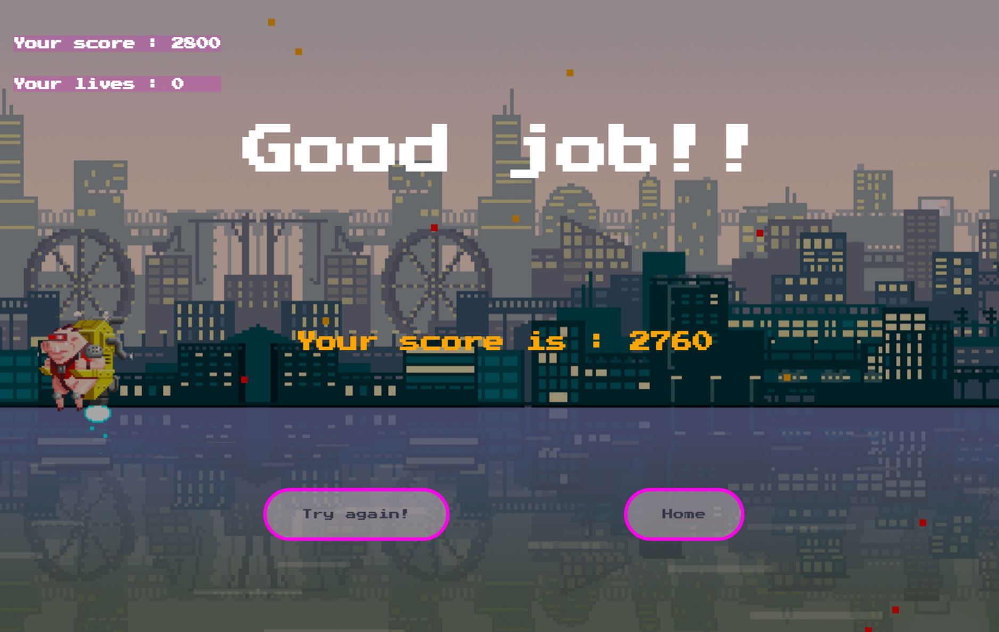

# PIG Radius Wars

**2D Arcade Shooter built with JavaScript and Canvas**

PIG Radius Wars is a browser-based arcade shooter developed with **HTML, CSS, and Vanilla JavaScript** using the **Canvas API**.

In the game, you control a flying pig equipped for battle, fighting to survive incoming enemy waves while dodging attacks, shooting back, and trying to achieve the highest score possible.

---

## Demo

- **YouTube Gameplay:** https://youtu.be/-Xv-vK01TUo
- **Live Demo:** https://miguelmorenogit.github.io/Ironhack-GameProject-PigRadiusWars
- **GitHub Repository:** https://github.com/MiguelMorenoGit/Ironhack-GameProject-PigRadiusWars

---

## Screenshots

<p align="center">
  
</p>

<p align="center">
  
</p>

<p align="center">
  
</p>

---

## About the Project

This project was built as a browser game to strengthen core front-end and game development skills, with a focus on:

- **DOM manipulation**
- **Canvas rendering**
- **Object-oriented programming**
- **Game loop architecture**
- **Collision systems**
- **Animation handling**
- **Player input and game states**

As development progressed, I continuously refined the game by fixing bugs, improving performance, polishing collisions, and enhancing the overall gameplay experience.

---

## Main Features

- 2D player movement
- Projectile shooting system
- Lives and score system
- Enemy spawning and movement patterns
- Animated explosion effects
- Pause and resume system
- Game over screen
- Parallax scrolling background
- Debug tools for hitboxes and sprite boxes

---

## Controls

- **Arrow Up** — Move up
- **Arrow Down** — Move down
- **Arrow Left** — Move left
- **Arrow Right** — Move right
- **Space** — Shoot
- **Enter** — Pause / Resume

---

## Tech Stack

- **HTML5**
- **CSS3**
- **JavaScript (Vanilla JS)**
- **Canvas API**

---

## Project Structure

```bash
.
├── index.html
├── style.css
├── main.js
├── game.js
├── player.js
├── playerShoot.js
├── enemyCharger.js
├── explosion.js
├── background.js
├── parallax1.js
├── parallax2.js
├── clouds.js
├── assets.js
└── settings.js
```
---

## What I Improved

During development, I iterated on several areas to improve the quality and polish of the game:

- Fixed restart and performance issues
- Improved cleanup of event listeners and animation loops
- Refined collisions between player, enemies, and projectiles
- Separated hitbox logic from visual sprite dimensions
- Added temporary invincibility after taking damage
- Added blinking and transparency feedback on hit
- Improved pause and game over presentation

---

## Future Improvements

- New enemy types
- Enemy shooting mechanics
- Power-ups
- Better difficulty balancing
- More polished sound design
- Settings/options menu
- Improved responsive support

---

## Author

**Miguel Ángel Moreno**

- **GitHub:** https://github.com/MiguelMorenoGit
- **LinkedIn:** https://www.linkedin.com/in/miguelangelmoreno-gamedev

---

## Portfolio Note

This project is part of my game development portfolio and showcases my ability to build interactive gameplay systems with JavaScript, manage game states, handle collisions and animations, and create complete browser-based experiences using Canvas.


